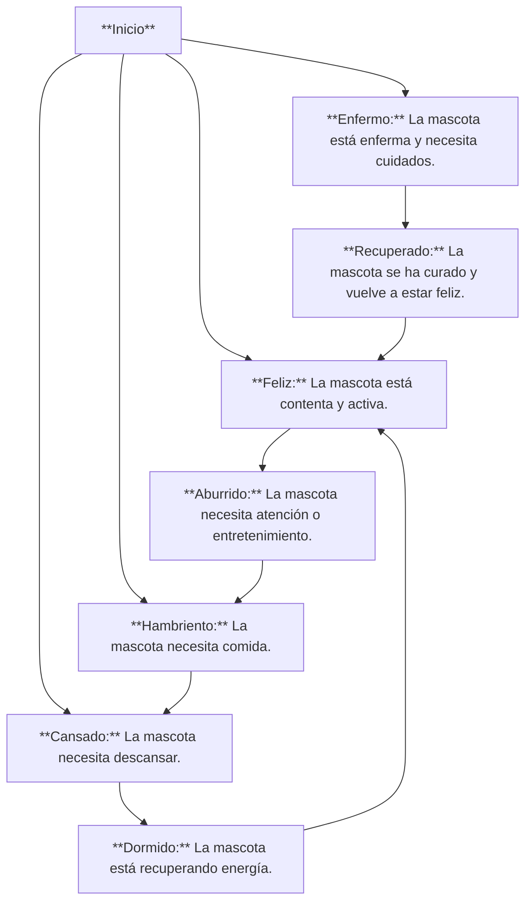

# Estados de la Mascota Tontisima

```mermaid
graph TD
    Inicio[**Inicio**] --> Feliz[**Feliz:** La mascota está contenta y activa.]
    Inicio --> Hambriento[**Hambriento:** La mascota necesita comida.]
    Inicio --> Cansado[**Cansado:** La mascota necesita descansar.]
    Inicio --> Enfermo[**Enfermo:** La mascota está enferma y necesita cuidados.]
    
    Feliz --> Aburrido[**Aburrido:** La mascota necesita atención o entretenimiento.]
    Aburrido --> Hambriento
    Hambriento --> Cansado
    Cansado --> Dormido[**Dormido:** La mascota está recuperando energía.]
    Dormido --> Feliz
    
    Enfermo --> Recuperado[**Recuperado:** La mascota se ha curado y vuelve a estar feliz.]
    Recuperado --> Feliz
```

